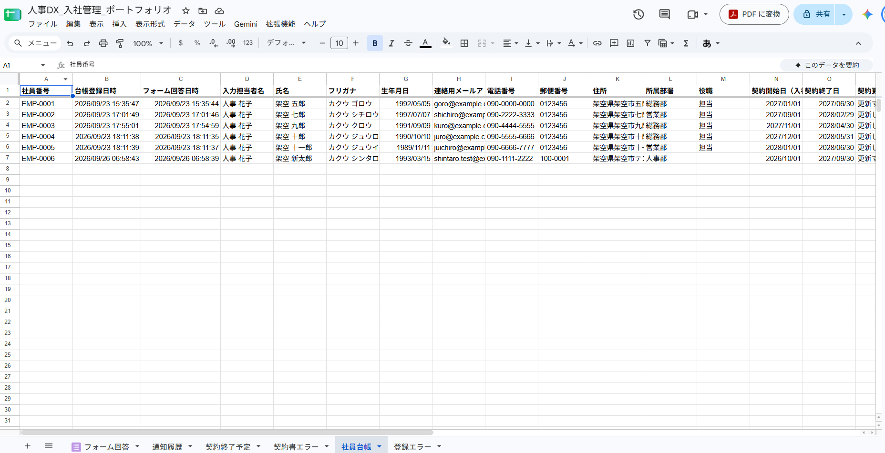

# HR-DX Onboarding Automation

**入社手続きの自動化（Google Apps Script）**

Googleフォームに入社情報を入力すると、社員台帳への登録・雇用契約書の下書き作成・契約終了が近い人への通知までを、Google のサービスの中で自動で進める仕組みです。

## 概要

架空の企業「サンプルリテール株式会社」の人事担当者を想定して作った、人事DX（業務のデジタル化）のポートフォリオです。

- 社員・会社・住所・メールアドレスなど、**データはすべて架空**です。実在する個人情報や企業情報は使っていません。
- Googleフォーム・スプレッドシート・ドキュメント・ドライブと、Google Apps Script（Google のサービスを自動で動かす仕組み）だけで動きます。Google 以外の外部サービスやサーバーは使っていません。

## 解決する課題

入社手続きを手作業で行うと、次のような手間や抜け漏れが起きやすくなります。この仕組みは、それぞれを次のように自動化・省力化します。

| 手作業で起きやすいこと | この仕組みでの対応 |
|---|---|
| 入社情報を別の表へ転記する手間と、写し間違い | フォームの回答を、そのまま社員台帳に1人1行で登録する |
| 社員番号の付け間違い・重複 | `EMP-0001` から自動で連番を付ける。ほぼ同時に送信されても番号が重ならない |
| 入力不備の見落とし | 形式の誤りはフォームで止める。契約期間・勤務時間の前後の誤りや、同じ人の二重登録は台帳に入れず、理由を記録する |
| 雇用契約書を1通ずつ作る手間 | テンプレートに26項目を差し込み、Googleドキュメントで下書きを作る |
| 契約終了日の確認漏れ | 契約終了まで30日以内の人を毎日抽出する |
| 担当者への連絡漏れ | 毎日8時台に、対象者をまとめた通知メールを1通送る。同じ日に同じ人の通知を二度送らない |

## 主な機能

業務の流れの順に並べています。

1. **入社登録フォーム**：基本情報・契約更新の条件・就業条件を入力するGoogleフォーム。契約更新の有無などで、答える質問が切り替わります。
2. **社員台帳への自動登録**：フォームが送信されると、社員番号を付けて「社員台帳」シートに登録します。
3. **入力チェック・エラー記録**：メールアドレスや郵便番号の形式はフォームで確認します。契約期間・勤務時間・重複の誤りは「登録エラー」シートに理由を残し、台帳には登録しません。
4. **雇用契約書の下書き作成**：登録された社員ごとに、テンプレートから雇用契約書（下書き）を作り、社員台帳にそのURLと作成日時を記録します。失敗したときは「契約書エラー」シートに理由を残します。
5. **契約終了予定者の抽出**：契約終了まで0〜30日の社員を、残り日数の少ない順に「契約終了予定」シートへ書き出します。
6. **契約終了通知**：毎日8時台に、対象者をまとめたメールを1通送ります。対象者が0人の日は送りません。
7. **通知履歴・二重通知の防止**：「通知履歴」シートに、送信中・送信済み・送信失敗を記録します。同じ日に同じ人へは二度送らず、失敗したものは次の実行で送り直します。

## 全体の流れ

```text
Googleフォーム（入社登録フォーム）
  │ 送信すると自動で動く
  ▼
フォーム回答シート ──（誤り・重複）──▶ 登録エラーシート
  │
  ▼
社員台帳シート（社員番号を付けて登録）
  │ 続けて自動で動く
  ▼
雇用契約書の下書き（Googleドキュメント／Googleドライブに保存）
  │                     └─（失敗）──▶ 契約書エラーシート
  ▼
契約終了予定シート（契約終了まで30日以内の社員）
  │ 毎日8時台に自動で動く
  ▼
通知メール（テストモード中はテスト用の送り先だけ） ＋ 通知履歴シート
```

## 使用技術

**仕組みを動かしているもの**

| 技術 | 使いどころ |
|---|---|
| Google Apps Script（V8） | すべての処理（`コード.js`） |
| Googleフォーム（FormApp） | 入社登録フォームの作成 |
| Googleスプレッドシート（SpreadsheetApp） | 回答・社員台帳・エラー・契約終了予定・通知履歴の6シート |
| Googleドキュメント（DocumentApp） | 雇用契約書のテンプレートと下書き |
| Googleドライブ（DriveApp） | 契約書の保存フォルダ |
| MailApp | 通知メールの送信 |
| トリガー（ScriptApp） | フォーム送信時の自動処理と、毎日8時台の自動実行 |
| スクリプト プロパティ（PropertiesService） | ファイルのIDや送り先など、コードに書かない設定の保存 |
| LockService | 同時に動いたときに、1件ずつ順番に処理する |

**開発に使ったもの**

- **clasp**：手元のコードを Google Apps Script に反映する道具
- **Git**：変更の記録
- **Cursor／Claude Code**：AIによる開発支援。段階を分けて開発し、各段階で Google 上の実機テストに合格してから記録（コミット）しています

## ファイル構成

```text
hr-dx-onboarding-automation/
├── README.md                  このファイル
├── コード.js                  仕組みのすべての処理（Google Apps Script）
├── appsscript.json            Apps Script の設定（タイムゾーン Asia/Tokyo・V8）
├── .gitignore                 Git に記録しないファイルの一覧
└── docs/
    ├── 操作マニュアル.md      初期設定と日々の使い方
    ├── テスト仕様書.md        テストの内容と結果
    └── images/                README で使用する画面画像
```

`.clasp.json`（手元のコードと Google をつなぐ設定。スクリプトIDが入る）と `.clasprc.json`（ログイン情報）は `.gitignore` で除外しており、公開していません。

## セットアップ概要

詳しい手順は **[操作マニュアル](docs/操作マニュアル.md)** にあります。ここでは流れだけを示します。

1. Apps Script のプロジェクトに `コード.js` と `appsscript.json` を置く
2. `setupOnboardingForm` を実行する：フォームと回答先スプレッドシートができる
3. `setupEmployeeLedger` を実行する：社員台帳・登録エラーのシートと、フォーム送信時のトリガーができる
4. `setupEmploymentContracts` を実行する：契約書の保存フォルダ・テンプレート・契約書エラーのシートができる
5. スクリプト プロパティにテスト用の送り先（`NOTIFY_TEST_RECIPIENT`）を入れ、`notifyContractsEndingSoon` を手で試す
6. `setupDailyNotificationTrigger` を実行する：毎日8時台の通知トリガーができる

どの setup 関数も、何度実行しても同じものを二重に作らないようにしています。

## テスト

段階ごとにテストし、合格してから次の段階に進みました。テストデータはすべて架空の人物です。詳しくは **[テスト仕様書](docs/テスト仕様書.md)** を見てください。

- **実機テスト**：Google 上で実際に動かし、画面で結果を確かめたテスト
- **ローカル模擬テスト**：Google の部品の動きを手元で模擬して、コードの判断を確かめたテスト（Google 上のデータには触れない）

| 段階 | 実機テスト | ローカル模擬テスト |
|---|---|---|
| 入社登録フォーム | 14項目 合格（1項目は不具合を直した後に合格） | 未実施（構文・静的確認は合格） |
| 社員台帳への登録 | 15項目 合格（1項目は不具合を直した後に合格）＋追加修正1件 合格 | 時刻の読み取り 8項目 合格 |
| 雇用契約書の下書き作成 | 正常系・表示・重複生成の防止・セットアップの再実行 合格 | 27件 合格 |
| 契約終了予定者の抽出 | 境界テスト11件を含む T1〜T4 合格（対象者0人の場合） | 全項目 合格 |
| 契約終了通知 | 対象0人・送信・同日の再実行・送信失敗と再送・トリガー作成・一時トリガーでの自動実行・本来の毎日8時台のトリガーでの自動実行など 合格 | 17場面・確認項目77件、最終実行ですべて PASS |

主な確認の例：
- 同じ日に通知を再実行しても、2通目は送られない
- 送信にわざと失敗させると、メールは送られず「送信失敗」が記録され、設定を戻すと送り直される
- 何度セットアップしても、フォーム・シート・フォルダ・テンプレート・トリガーが増えない
- 通知の後も、社員台帳・契約書・ほかのシートは変わらない
- 本来の毎日8時台のトリガーが、2026/09/27 8:30:33 に通知の処理（`notifyContractsEndingSoon`）を自動で実行し、正常に終わった（Apps Script の「実行数」の画面で確認。メールの送信までは確かめていない）

**まだ実施していないテスト（4件）**

| 番号 | 内容 |
|---|---|
| 1-L1 | 入社登録フォームのローカル模擬テスト（動きは実機テストで確認済み） |
| 3-12 | 契約書の作成に失敗したときの動き（実機。ローカル模擬テストでは確認済み） |
| 3-15 | 契約更新が「更新しない」の場合の契約書表示（実機。ローカル模擬テストでは確認済み） |
| 4-01 | 対象者がいるときの抽出を、抽出の機能だけで確かめる実機テスト（通知のテストの中では確認済み） |

本番の送り先への送信は、まだテストの対象にしていません。

## スクリーンショット

画面に写っている人物・会社・連絡先は、すべて架空のデータです。

### 入社登録フォーム

入社情報を入力する Googleフォームです。


### 社員台帳

フォームの回答が、社員番号を付けて1人1行で登録されます。



### 雇用契約書の下書き

登録された社員ごとに、テンプレートから Googleドキュメントで作られる雇用契約書の下書きです。


### 契約終了通知メール（テストモード）

契約終了まで30日以内の社員をまとめた通知メールの本文です。テストモードで、テスト用の送り先に送ったものです。


## 安全・プライバシー

- ポートフォリオに出てくる企業・人物・データは、すべて架空です。
- 実際のメールアドレス、Google の各ファイルの URL、スクリプトID、各種ID は公開していません。メールアドレスなどは、コードに書かずスクリプト プロパティに保存しています。
- `.clasp.json` は Git の管理対象外です。
- 通知機能は現在**テストモード**で使っています。テストモードの間は、テスト用の送り先にだけ送り、本番の送り先は読みません。
- 実際の業務で使う場合は、組織の運用ルール、個人情報の扱い、Google アカウントやファイルの権限設定などを確認する必要があります。

## 今後の改善候補

現在の仕組みは、上に書いた範囲で動いています。次は、必要に応じて検討できる発展案です（**いずれも未実装**です）。

- 本番の送り先での運用確認と、テストモードから本番モードへの切り替え手順の整備
- 通知のタイミングの調整（現在は、契約終了まで30日以内の間は毎日通知に載る）
- 日をまたぐ勤務（夜勤など）への対応（現在は、終業時刻が始業時刻より後の勤務だけを扱う）
- 未実施のテスト（上の4件）の実施

## 関連ドキュメント

- [操作マニュアル](docs/操作マニュアル.md)：初期設定、日々の使い方、よくある確認ポイント
- [テスト仕様書](docs/テスト仕様書.md)：各段階のテストの内容と結果、未実施の項目
