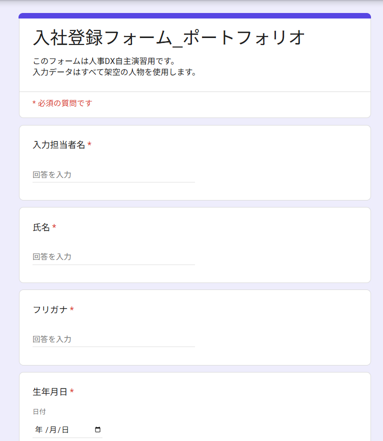
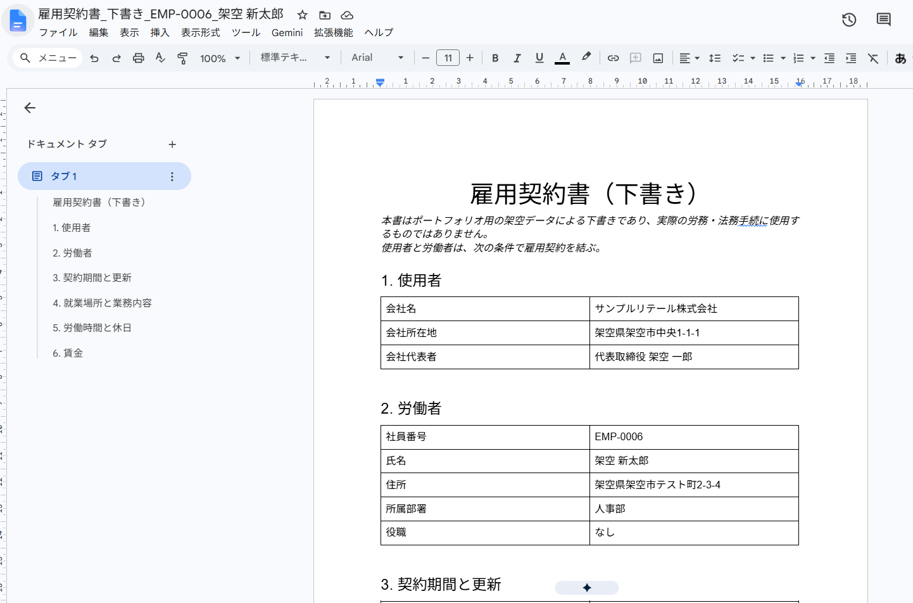
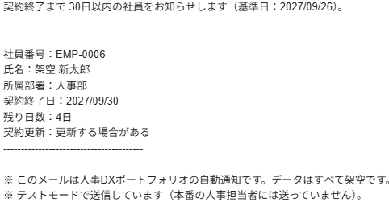

# 操作マニュアル

人事DX 入社手続き自動化ポートフォリオの使い方をまとめたマニュアルです。
Google Apps Script（Google のサービスを自動で動かすための仕組み）に詳しくない方でも、上から順に読めば操作できるように書いています。

> **この仕組みはポートフォリオ（制作実績）です。** 入力するデータは、すべて架空の人物・架空の会社にしてください。実在する人の個人情報は入れないでください。

テストの内容と結果は [テスト仕様書](テスト仕様書.md) にまとめています。

---

## 1. この仕組みでできること

入社する人の情報を Googleフォームに入力すると、次のことが自動で進みます。

1. **入社情報を Googleフォームで入力する**
2. **社員台帳に登録する**：社員番号（`EMP-0001` の形）を付けて、1人1行で登録します
3. **入力の誤り・登録できなかった理由を記録する**：「登録エラー」シートに残します
4. **雇用契約書の下書きを作る**：Googleドキュメントで、社員ごとに1通作ります
5. **契約終了が近い人を抽出する**：契約終了日まで30日以内の人を一覧にします
6. **契約終了の通知メールを送る**：毎日8時台に、対象者をまとめたメールを1通送ります
7. **通知履歴を残す**：いつ・誰について・送れたかどうかを記録します

作られるもの（名前はすべてポートフォリオ用です）：

| もの | 名前 |
|---|---|
| Googleフォーム | 入社登録フォーム_ポートフォリオ |
| Googleスプレッドシート | 人事DX_入社管理_ポートフォリオ |
| Googleドライブのフォルダ | 人事DX_雇用契約書_ポートフォリオ |
| 雇用契約書のひな形（テンプレート） | 雇用契約書テンプレート_ポートフォリオ（上のフォルダの中） |
| 雇用契約書の下書き | 雇用契約書_下書き_社員番号_氏名（例：雇用契約書_下書き_EMP-0006_架空 新太郎） |

契約書に入る会社の情報も架空です（サンプルリテール株式会社）。

---

## 2. 先に知っておくと読みやすい言葉

| 言葉 | 意味 |
|---|---|
| スクリプトエディタ | Google Apps Script のコードを開いて動かす画面 |
| 関数 | ひとまとまりの処理。名前（例：`setupOnboardingForm`）を選んで「実行」を押すと動く |
| 実行ログ | 関数を動かしたときに出る記録。何をしたか、なぜ止まったかが書かれる |
| 実行数 | スクリプトエディタの左側にある画面。過去の実行の一覧と、それぞれの成功・失敗が見られる |
| トリガー | 決まったときに関数を自動で動かす仕組み。この仕組みでは「フォームが送信されたとき」と「毎日8時台」の2つを使う |
| スクリプト プロパティ | Google 側に保存しておく設定の値。メールアドレスのように、コードに書きたくないものを入れる |

---

## 3. 初期設定（最初の1回だけ）

**前提**：この章の手順は、このリポジトリの `コード.js` と `appsscript.json` が、使う Apps Script のプロジェクトに反映されている状態から始めます。そのうえで、`setupOnboardingForm` などのセットアップ関数を、3-2 の順番に実行します。

### 3-1. 関数の実行のしかた

1. スクリプトエディタを開きます。
2. 画面上部の関数を選ぶ欄で、実行したい関数の名前を選びます。
3. 「実行」を押します。
4. 初めて動かす関数では、Google から「このスクリプトに許可を与えますか」という画面が出ることがあります。内容を確かめて許可してください。
5. 画面下の実行ログに結果が出ます。赤い文字のエラーが出ていないか確かめます。

**どの setup 関数も、何度実行しても同じものが二重に作られない**ように作ってあります（テスト仕様書 1-03・2-03・2-04・3-14・T5 で確認済み）。

### 3-2. 実行する順番

次の順に実行してください。順番を飛ばすと、「先に ○○ を実行してください」というエラーで止まります。

| 順番 | やること | 何ができるか | 実行ログで確かめること |
|---|---|---|---|
| ① | `setupOnboardingForm` を実行する | 入社登録フォームと、回答を保存するスプレッドシートができる。回答が入るシートの名前が「フォーム回答」になる | 「フォームを新しく作りました。」と、フォーム（編集用）・フォーム（回答用）・スプレッドシートの URL |
| ② | `setupEmployeeLedger` を実行する | 「社員台帳」「登録エラー」シートと、フォーム送信時に自動で動くトリガーができる | 「社員台帳の準備ができました」 |
| ③ | `setupEmploymentContracts` を実行する | 社員台帳に「契約書URL」「契約書作成日時」の2列が足される。「契約書エラー」シート、契約書の保存フォルダ、テンプレートができる | 「契約書の準備ができました。」と「契約書を自動で作るのは EMP-○○○○ からです。」 |
| ④ | スクリプト プロパティに、テスト用の送り先を入れる | 通知メールの送り先が決まる | （4章の手順を見てください） |
| ⑤ | `notifyContractsEndingSoon` を1回、手で実行する | 通知の動きを試せる。対象者が0人ならメールは送らない | 「送信モード：テスト」 |
| ⑥ | `setupDailyNotificationTrigger` を実行する | 毎日8時台に通知を自動で動かすトリガーができる | 「毎朝の通知トリガーを作りました（毎日 8時台に notifyContractsEndingSoon を実行）。」 |

**気をつけること**
- ①〜③の実行ログに出る URL は、あなたの環境のフォーム・スプレッドシート・フォルダ・テンプレートの住所です。**人に見せる資料や公開する場所に貼らないでください。**
- ③は、**フォームで最初の回答を送る前に**実行してください。③より前に登録された社員には、契約書は自動で作られません（7-2 を見てください）。
- ⑥は、テスト用の設定（`NOTIFY_TEST_BASE_DATE`・`NOTIFY_TEST_FORCE_SEND_ERROR`）が残っていると、トリガーを作らずに止まります。テストが終わってから、この2つを消して実行してください。

### 3-3. トリガーが正しくできたかの確かめ方

スクリプトエディタの左側の ⏰「トリガー」を開きます。次の2件があれば正しい状態です。

| 動かす関数 | いつ動くか |
|---|---|
| `onFormSubmitToLedger` | フォームが送信されたとき |
| `notifyContractsEndingSoon` | 毎日8時台（時間主導型） |

---

## 4. テストモードについて

### 4-1. いまの状態

**現在はテストモードです。** コードの中の `NOTIFICATION_TEST_MODE` という設定が `true`（オン）になっています。

テストモードの間は、次のように動きます。

- 通知メールは、**テスト用の送り先（`NOTIFY_TEST_RECIPIENT`）にだけ**届きます
- **本番の人事担当者の送り先（`NOTIFY_HR_RECIPIENT`）は、読みにも行きません。** 誤って本番に送ることはありません
- メールの件名の頭に **【テスト】** が付きます
- 本文の最後に「テストモードで送信しています（本番の人事担当者には送っていません）。」と入ります

### 4-2. テスト用の送り先の設定

メールアドレスはコードに書かず、スクリプト プロパティに入れます。

1. スクリプトエディタの左側の ⚙「プロジェクトの設定」を開きます。
2. 下のほうの「スクリプト プロパティ」で「プロパティを追加」を押します。
3. プロパティの名前に `NOTIFY_TEST_RECIPIENT`、値に**テスト用のメールアドレスを1つだけ**入れて保存します。

- 空欄のとき、またはカンマなどで2つ以上並べたときは、メールを送らずにエラーで止まります。
- **この文書やポートフォリオには、実際のメールアドレスを書かないでください。**

### 4-3. テストのときだけ使える設定

テストモードのときだけ効く設定が2つあります。本番モードでは読まれません。

| プロパティの名前 | 使い方 |
|---|---|
| `NOTIFY_TEST_BASE_DATE` | `2027/03/01` の形で入れると、その日を「今日」として対象者を探す。対象者がいる日を作ってテストするときに使う |
| `NOTIFY_TEST_FORCE_SEND_ERROR` | `true` にすると、メールを送る直前でわざと失敗させる（メールは出ていかない）。失敗したときの動きを試すときに使う |

**テストが終わったら、この2つは必ず消してください。** 残っていると、毎日8時台のトリガーを作れません（3-2 ⑥）。

### 4-4. 本番モードについて（参考）

**現在は本番モードに切り替えていません。切り替えるかどうかは、管理者が判断します。** ここでは、コードから分かる範囲だけを参考として書きます。

- 本番モードにするには、コードの `NOTIFICATION_TEST_MODE` を `false` にして、Google 側に反映する必要があります。
- 本番モードでは、送り先としてスクリプト プロパティの `NOTIFY_HR_RECIPIENT`（メールアドレス1つ）を読みます。空欄ならエラーで止まります。
- 本番モードでは、件名に【テスト】が付かず、テスト用の設定（4-3 の2つ）も読みません。
- 通知履歴は「テスト」と「本番」を別に数えます。テストで送った記録が、本番の通知を止めることはありません。

**注意：本番モードの動きは、手元の模擬テストでしか確かめていません**（テスト仕様書 5-L14）。本番の送り先に実際に送るテストは、まだしていません。

---

## 5. 普段の使い方

### 5-1. 入社登録フォームに回答する

1. 入社登録フォームを開きます（回答用の URL は、3-2 ①の実行ログに出ています）。
2. 上から順に入力します。「入力担当者名」には、入力した人の名前（例：人事 花子）を入れます。
3. 最後まで進んで「送信」を押します。

フォームの流れ：

| セクション | 質問 | 次に進む先 |
|---|---|---|
| 基本情報 | 入力担当者名〜契約更新（1〜13） | 契約更新が「更新する場合がある」なら「契約更新の条件」へ。「更新しない」なら「就業条件」へ |
| 契約更新の条件 | 更新判断基準・更新上限（14・15） | 更新上限が「あり」なら「更新上限の内容」へ。「なし」なら「就業条件」へ |
| 更新上限の内容 | 更新上限の内容（16） | 「就業条件」へ |
| 就業条件 | 就業場所〜諸手当（17〜27） | 送信 |

入力のきまり：
- 「役職」と「諸手当」以外は、すべて必須です
- 連絡用メールアドレスは、メールアドレスの形でないと先に進めません
- 郵便番号は `123-4567` か `1234567` の形で入れます
- 休憩時間（分）と基本給（月額）は、0以上の数字で入れます
- 更新判断基準は複数選べます。「その他」を選ぶと自由に書けます

入社登録フォームを開くと、次のような画面になります。

### 5-2. 社員台帳を確認する

1. スプレッドシート「人事DX_入社管理_ポートフォリオ」を開きます。
2. 「社員台帳」シートを開きます。
3. いちばん下の行に、送信した人が追加されているか確かめます。

- A列に社員番号（`EMP-0001` から順番）が付きます
- 電話番号・郵便番号の先頭の0は消えずに残ります
- 契約書ができると、AE列に「契約書URL」、AF列に「契約書作成日時」が入ります

登録されていない場合は、次の「登録エラー」を見てください。

### 5-3. 登録エラーを確認する

「登録エラー」シートに、社員台帳に登録できなかった回答が記録されます。

| エラー種別 | どんなときか |
|---|---|
| 重複 | 同じメールアドレスと同じ生年月日の社員が、すでに社員台帳にいる（メールアドレスの大文字・小文字の違いは同じとみなす） |
| 契約期間エラー | 契約終了日が、契約開始日より前になっている |
| 勤務時間エラー | 終業時刻が、始業時刻と同じか、それより前になっている（日をまたぐ勤務は扱わない） |

- 「フォーム回答行」の列を見ると、「フォーム回答」シートの何行目の回答かが分かります
- エラーになった回答には、社員番号を使いません（番号が飛びません）

**登録し直すには：** 正しい内容で、フォームからもう一度送信してください。エラーになった回答が、あとから自動で登録し直されることはありません。

### 5-4. 雇用契約書を確認する

1. 社員台帳で、その社員の AE列「契約書URL」を開きます。
2. 雇用契約書（下書き）の内容が、フォームの入力どおりになっているか確かめます。

表示のきまり：
- 契約更新が「更新しない」のときは、更新判断基準・更新上限・更新上限の内容が「該当なし」になります
- 更新上限が「なし」のときは、更新上限の内容が「該当なし」になります
- 役職・諸手当が空欄のときは「なし」になります
- 基本給は「250,000円」のように表示されます

確認のコツ：契約書の中で `{{` を検索し、0件なら差し込み漏れはありません。

契約書は Googleドライブのフォルダ「人事DX_雇用契約書_ポートフォリオ」にも保存されています。

自動で作られた雇用契約書（下書き）は、次のような見た目になります。

### 5-5. 契約終了予定を確認する

「契約終了予定」シートに、**契約終了日まで今日から0〜30日の社員**が並びます。

- 毎日8時台の通知のときに、自動で作り直されます
- すぐに見たいときは、スクリプトエディタで `extractContractsEndingSoon` を手で実行します（メールは送りません）
- 並び順は、残り日数の少ない順です。同じ日数なら社員番号の順です
- 今日が契約終了日の人は「残り0日」で載ります。31日以上先の人、すでに終わった人は載りません

**このシートに書き込まないでください。** 実行するたびに、見出しを残して2行目以下を作り直すので、書いたメモは消えます。

### 5-6. 通知メールと通知履歴を確認する

**通知メール**

毎日8時台に、契約終了まで30日以内の人をまとめたメールが1通届きます（テストモードでは、テスト用の送り先に届きます）。

- 件名の例：【テスト】契約終了予定のお知らせ（2027/09/26・1名）
- 本文：1人ずつ、社員番号・氏名・所属部署・契約終了日・残り日数・契約更新の6項目
- 対象者が0人の日は、メールは送りません

テストモードで届いた通知メールの本文は、次のとおりです。

**通知履歴**

「通知履歴」シートに、1回の通知ごとに、対象者1人につき1行が残ります。対象者が初めて出た日に、このシートが作られます。

| 状態 | 意味 |
|---|---|
| 送信中 | メールを送る直前に書く記録。送り終わると「送信済み」に変わる |
| 送信済み | 送れた |
| 送信失敗 | 送れなかった。「詳細」の列に理由が残る。次の実行で送り直す |

失敗した行も消さずに残ります。あとから見返せる記録になります。

---

## 6. 各シートの役割

スプレッドシート「人事DX_入社管理_ポートフォリオ」には、次の6つのシートがあります。

| シート | 役割 | 主な列 | 人が書き込んでよいか |
|---|---|---|---|
| フォーム回答 | フォームの回答がそのまま入る元データ。1回答につき1行 | 1列目がタイムスタンプ、以降がフォームの質問 | 書き込まない |
| 社員台帳 | 登録できた社員の一覧。1人1行 | A 社員番号、B 台帳登録日時、C フォーム回答日時、D〜AD フォームの27項目、AE 契約書URL、AF 契約書作成日時（全32列） | 1行目の見出しは変えない |
| 登録エラー | 社員台帳に登録できなかった回答と、その理由 | 発生日時・フォーム回答行・氏名・連絡用メールアドレス・生年月日・エラー種別・詳細 | 書き込まない |
| 契約書エラー | 契約書を作れなかった社員と、その理由 | 発生日時・社員番号・氏名・エラー種別・詳細・対象ファイル名・対象ファイルURL | 書き込まない |
| 契約終了予定 | 契約終了まで30日以内の社員の一覧（表示用） | 社員番号・氏名・所属部署・契約終了日・残り日数・契約更新 | 書き込まない（毎回作り直される） |
| 通知履歴 | 通知メールの記録 | 通知日・社員番号・契約終了日・送信モード・状態・記録日時・詳細 | 普段は書き込まない（例外は下の「通知履歴を手で直す場合」） |

- **シートの名前と、1行目の見出しは変えないでください。** 仕組みはシート名と見出しの名前で場所を探しています。見出しが違うと、書き込まずにエラーで止まります。

### 通知履歴を手で直す場合

**通知履歴は、普段は編集しません。** 記録がうまくいかなかったときに、「送信中」のまま行が残ることがあります。原因によって扱いが違うので、実行ログのエラー文で、どちらの場合かを確かめてください。

| 場合 | 実行ログのエラー文 | 手で直すか |
|---|---|---|
| ① メールの送信に失敗し、さらに履歴を「送信失敗」にすることにも失敗した | 「メールの送信に失敗し、通知履歴を「送信失敗」にもできませんでした。」で始まる | **直す。** エラー文に出ている行の「状態」を、手で「送信失敗」に直す |
| ② メールは送れたが、履歴を「送信済み」にすることに失敗した | 「メールは送りましたが、通知履歴を「送信済み」にできませんでした。」で始まる | **直さない。** 「送信中」のままにしておく |

- **①のとき**：メールは届いていません。エラー文に、通知履歴の何行目から何行が「送信中」のままかが出ます。その行を「送信失敗」に直すと、次の実行で送り直します。「送信中」のままだと送信済みとして数えられ、その日は送り直されません。
- **②のとき**：メールは届いています。「送信中」は通知済みとして数えるので、同じ日に二重には送りません。二重送信を防ぐための状態なので、**むやみに手で書き換えないでください。** エラー文に出ている行を見て、記録が残っていることだけを確かめます。
- このほかの場合（「送信済み」「送信失敗」の行など）は、手で直さないでください。

---

## 7. よくある確認ポイント

### 7-1. フォームを送ったのに、社員台帳に登録されない

1. **「登録エラー」シートを見る**：理由が書かれていれば、5-3 のとおり直して送り直します。
2. **登録エラーにも出ていないとき**：スクリプトエディタの左側の「実行数」で、`onFormSubmitToLedger` の実行が「失敗」になっていないか見ます。
3. **トリガーを見る**：3-3 のとおり、`onFormSubmitToLedger` のフォーム送信トリガーがあるか確かめます。なければ `setupEmployeeLedger` を実行します。

### 7-2. 契約書が作られない

1. **その社員の番号を見る**：契約書が自動で作られるのは、`setupEmploymentContracts` を実行した後に登録された社員からです。実行ログの「契約書を自動で作るのは EMP-○○○○ からです。」の番号より前の社員には、作りません。これは仕組みどおりの動きです。
2. **`setupEmploymentContracts` を実行したか確かめる**：実行する前にフォームが送られた場合、社員台帳には登録されますが、契約書は作られません。
3. **「契約書エラー」シートを見る**：作れなかった理由が残ります。主な理由は次のとおりです。
   - 保存フォルダに、同じ名前の契約書が2つ以上ある（どれを使うか決められないため作らない）
   - テンプレートの差し込み位置（`{{会社名}}` などの26個）が足りない
   - 差し込んだ後に `{{…}}` が残っている
4. 途中で止まったときは、「作成中_」で始まる名前の文書が残ることがあります。**自動では消しません。** 契約書エラーの「対象ファイル名」「対象ファイルURL」で確かめてください。
5. **原因を直した後で作り直すには**：フォームの送信がない時間に、`generateMissingEmploymentContracts` を手で実行します。「契約書URL」が空欄の社員（開始番号以降）だけに作ります。同じ名前の完成版が1つだけあれば、新しく作らずにそれを使います。

※ 契約書の作成に失敗したときの動き（3・4）は、手元の模擬テストでだけ確かめています（テスト仕様書 3-12）。

### 7-3. 通知メールが届かない

上から順に確かめてください。

| 確かめること | どこを見るか | こうなっていたら |
|---|---|---|
| 対象者がいるか | 「契約終了予定」シート、または実行ログ | 0人なら、メールは送らないのが正しい動き |
| 今日すでに送っていないか | 「通知履歴」シート | 同じ日に同じ人へは、二度送らない（7-4） |
| 送り先はどこか | 4-1 | テストモードでは、テスト用の送り先にだけ届く |
| 送り先の設定 | ⚙「プロジェクトの設定」→ スクリプト プロパティ | 空欄や、2つ以上のアドレスだとエラーで止まる |
| 送信に失敗していないか | 「通知履歴」の「状態」と「詳細」 | 「送信失敗」なら、次の実行で送り直す |
| 自動で動いているか | ⏰「トリガー」と「実行数」 | `notifyContractsEndingSoon` の時間主導トリガーがあり、実行数に「時間主導型」の実行が残っているか |

- その日のメール送信数の上限に達しているときも、エラーで止まり、メールは送りません。
- **「送信中」のまま残った行があるとき**：メールは送れたのに、記録を「送信済み」にできなかった状態です。この行は通知済みとして数えるので、二重には送りません。実行ログのエラー文に、通知履歴の何行目かが出ます。

### 7-4. 同じ人に何度も通知が届かないのはなぜか

通知履歴に、次の4つが同じで、状態が「送信中」か「送信済み」の行があれば、その人には**その日はもう送りません**。

- 通知日
- 社員番号
- 契約終了日
- 送信モード（テスト／本番）

そのため：
- 同じ日に何回実行しても、メールは1通だけです（テスト仕様書 T3）
- 同じ日に新しく対象者が増えたときは、**新しい人だけ**のメールを送ります。本文に「本日すでにお知らせした ○名は除いています」と入ります
- **次の日には、また送ります。** 契約終了まで30日以内の間は、毎日の通知に載り続けます
- 手動の実行と毎朝の自動実行が重なっても、1つずつ順番に動くので、二重には送りません

### 7-5. setup 関数をもう一度実行しても大丈夫か

大丈夫です。すでにあるフォーム・スプレッドシート・シート・フォルダ・テンプレート・トリガーは、作り直さずにそのまま使います。テンプレートの中身も書き換えません。

ただし、**スクリプト プロパティに保存された ID（`FORM_ID`・`SPREADSHEET_ID`・`CONTRACT_FOLDER_ID`・`CONTRACT_TEMPLATE_ID`）が消えている場合や、そのファイルがゴミ箱に入っている場合は、新しく作ります。** 8章の注意を守ってください。

---

## 8. 安全上の注意

**個人情報**
- 実在する人の個人情報を、ポートフォリオ用のデータとして使わないでください。氏名・住所・電話番号・メールアドレスは、すべて架空にします。

**公開してはいけないもの**
- Google のフォーム・スプレッドシート・ドキュメント・ドライブ・Apps Script の URL
- スクリプトID、各ファイルの ID
- メールアドレス（テスト用も本番用も）
- Google アカウント名
- スクリプト プロパティの値
- `.clasp.json`（手元のコードと Google をつなぐ設定ファイル。スクリプトIDが入っています）

画面の画像を載せるときは、アドレスバー、メールの宛先・差出人、画面右上のアカウント表示、実行ログに出る URL を隠してください。

**通知機能を試す前に**
- `NOTIFICATION_TEST_MODE` が `true`（テストモード）になっていることを確かめてください。
- テスト用の送り先が、自分で受け取れるテスト用のアドレスになっていることを確かめてください。

**消したり、変えたりしないもの**
- スクリプト プロパティ（`FORM_ID`・`SPREADSHEET_ID`・`LAST_EMPLOYEE_NUMBER`・`CONTRACT_FOLDER_ID`・`CONTRACT_TEMPLATE_ID`・`CONTRACT_AUTOMATION_START_NUMBER`）。消すと、フォームなどが二重に作られたり、契約書を自動で作る対象（開始番号）が変わったりします
- 保存フォルダとテンプレート。ゴミ箱に入れると、契約書を作れなくなります
- テンプレートの中の `{{…}}`（26個の差し込み位置）。見た目は整えてかまいませんが、差し込み位置を消すと、契約書を作らずに止まります
- 各シートの名前と1行目の見出し
- フォーム回答・社員台帳・通知履歴などの記録
- コード（`コード.js`）

---

## 9. 手で実行できる関数の一覧

| 関数 | いつ使うか | メールを送るか |
|---|---|---|
| `setupOnboardingForm` | 初期設定 ① | 送らない |
| `setupEmployeeLedger` | 初期設定 ② | 送らない |
| `setupEmploymentContracts` | 初期設定 ③ | 送らない |
| `setupDailyNotificationTrigger` | 初期設定 ⑥ | 送らない |
| `extractContractsEndingSoon` | 契約終了予定だけを今すぐ作り直したいとき | 送らない |
| `notifyContractsEndingSoon` | 通知を今すぐ動かしたいとき（毎日8時台にも自動で動く） | 対象者がいれば送る |
| `generateMissingEmploymentContracts` | 契約書を作れなかった社員の分を作り直すとき（フォームの送信がない時間に） | 送らない |
| `testContractEndBoundaries` | 「残り日数」の数え方が正しいかを確かめるとき（台帳もシートも読まず、何も書かない） | 送らない |

**`onFormSubmitToLedger` は手で実行しないでください。** フォームが送信されたときに自動で動く関数です。手で実行すると、エラーで止まります。
